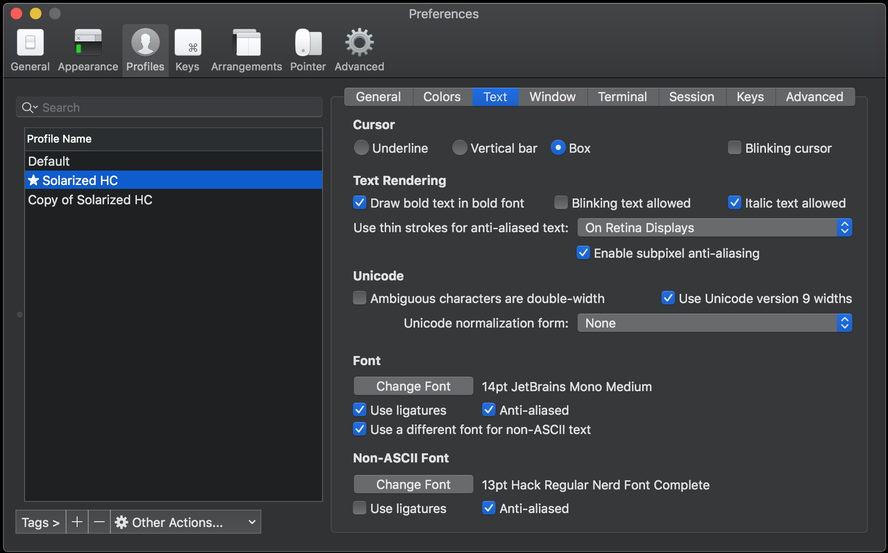

Powered conf
=======

## Installation

1. `iTerm2 + tmux`
1. `Install brew; oh my zsh`
2. `Copy configuration files from repo`
2. `brew install reattach-to-user-namespace`
3. `$ brew install the_silver_searcher`
3. `$ brew install fzf`
3. `$ $(brew --prefix)/opt/fzf/install`
4. `Confugure iTerm: Set "Applications in terminal may access clipboard" to true`

